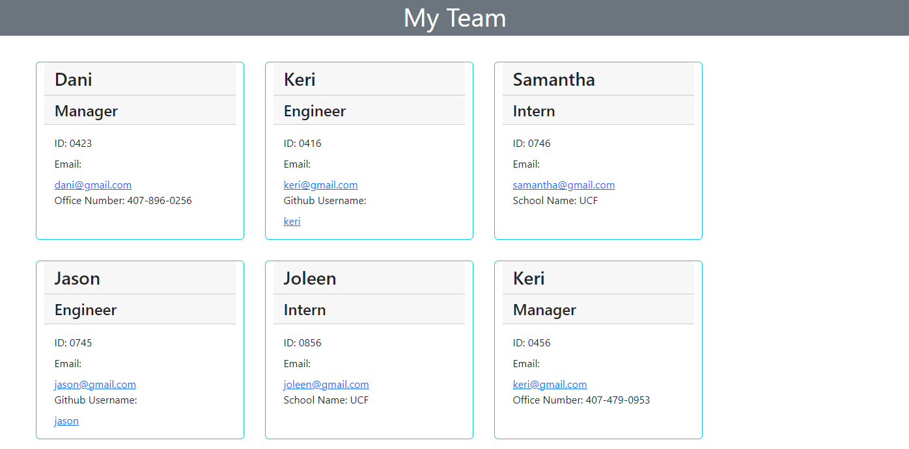

# TeamProfile

## Description

This is a Node.js command-line application that takes in information about employees on a software engineering team, then generates an HTML webpage that displays summaries for each person.

## Screenshot

## Video Walkthrough

[TeamProfile.webm](https://user-images.githubusercontent.com/116910257/219989991-e57e5ddf-ce06-4217-bbb7-f8d15645f328.webm)

## Link

<a href=https://github.com/shobannah/TeamProfile.git> Team Profile Github Repo (not deployed)
